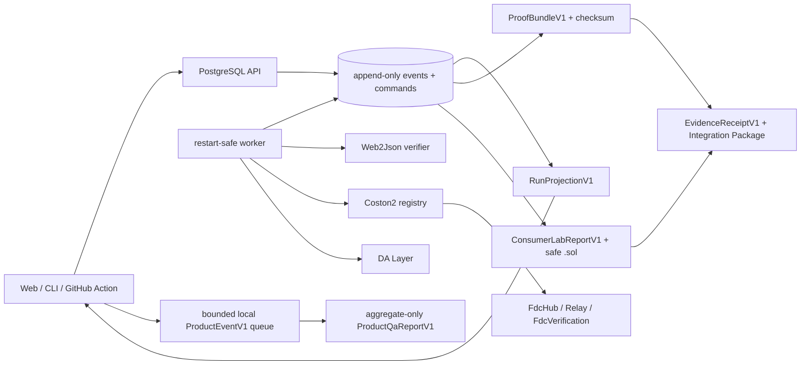

# Orivra architecture

## Назначение системы

Orivra превращает `Web2JsonManifestV1` в проверяемую цепочку evidence.
`Proofline` remains the compatibility identity of packages, environment,
persistence, evidence and deployment automation. Пользовательские поверхности
не реализуют FDC lifecycle самостоятельно: они работают через общие contracts и
persisted run API.

## Dependency direction

| Область | Ответственность | Не должна делать |
|---|---|---|
| `packages/contracts` | Versioned schemas и API types | I/O, clocks, persistence |
| `packages/domain` | State machine, journal, projection, diagnostics, replay, checksum, codegen, aggregate QA reporting | Network, PostgreSQL, process env |
| `packages/fdc-coston2` | Verifier, RPC, registry, Relay и DA ports/adapters | Владеть пользовательским flow или persistence |
| `apps/api` | Auth, idempotent HTTP commands, journal/artifact reads, PostgreSQL composition | Хранить private keys, выполнять relayer effect |
| `apps/worker` | Claim persisted commands, выполнять external effects, append outcomes, resume after restart | Принимать команды в обход API или использовать test adapters в production |
| `src`, `packages/cli`, `packages/action` | Пользовательские surfaces поверх публичных contracts | Дублировать lifecycle или обходить persisted release path |

Разрешённое направление зависимостей: contracts → domain → adapters/composition → surfaces. Pure packages не импортируют runtime composition.

## Network capability boundary

`FdcNetworkV1` — закрытый публичный словарь `coston2 | flare`, но выполнение
Web2Json определяется отдельным `NetworkCapabilityV1`. Публичный
`GET /v1/networks` возвращает канонические wallet/explorer metadata без
аутентификации и без upstream I/O: Coston2 имеет статус `enabled`, Flare —
`upstream-unsupported`.

Manifest может сохранить обе известные identity, чтобы поверхность честно
объяснила недоступность. API после project authentication и strict body
validation отклоняет Flare с `409 NETWORK_CAPABILITY_DISABLED` до
`service.createRun`. Production service повторяет guard до PostgreSQL. Поэтому
registry, verifier, source fetch, RPC, Relay и DA для Flare недостижимы.
Отдельный `Coston2Web2JsonManifestV1` дополнительно защищает `RUN_CREATED`,
proof bundle/replay, persisted reads, preflight, verifier и production
worker/live-adapter entries. Persisted run/proof/bundle/transaction schemas и
единственный production FDC adapter остаются Coston2-only. Условия будущей
активации зафиксированы в
[ADR 0023](docs/adr/0023-network-capability-boundary.md).

## Persisted run model

`run_events` — append-only источник истины. Каждое событие содержит `runId`, монотонный `sequence`, `type`, `occurredAt` и versioned payload. `RunProjectionV1` и `ProofBundleV1` выводятся из упорядоченного журнала.

`run_commands` — граница orchestration. Worker забирает команды через `FOR UPDATE SKIP LOCKED`, фиксирует attempt до external I/O и сохраняет outcome отдельной транзакцией. Наличие записанного transaction hash запрещает повторную broadcast после restart.

Основные таблицы:

- `projects`, `wallet_identities`, `wallet_challenges`, `api_tokens`,
  `share_tokens` — wallet tenancy, single-use auth evidence и capability tokens;
- `runs`, `run_events`, `run_artifacts` — состояние, preflight/consumer reports,
  bundle, receipt и generated Solidity artifacts;
- `run_commands` — restart-safe work queue;
- `relayer_transactions` — immutable broadcast/audit evidence.

## Live Coston2 lifecycle

1. API валидирует manifest, project token и idempotency key, создаёт run и preflight command.
2. Worker выполняет safe Web2Json preflight и получает verifier request/fee quote.
3. Wallet flow возвращает unsigned transaction и принимает отдельно broadcast tx hash. Relayer flow разрешается только авторизованному project token.
4. Worker получает receipt, вычисляет voting round через system contracts, ждёт Relay finalization и bounded DA proof.
5. Proof проверяется локально и через `FdcVerification.verifyWeb2Json` с `eth_call`.
6. Consumer Lab проверяет invariant evidence и генерирует safe consumer.
7. Bundle сериализуется canonical JSON, получает SHA-256 checksum и должен replay byte-identically.
8. Evidence Receipt и Integration Package связывают exact bundle, manifest,
   Consumer Lab result и safe Solidity для read-only handoff.

Все runtime-адреса FDC contracts, кроме известной точки registry, разрешаются через registry snapshot и попадают в evidence.

## Trust boundaries

### Static template catalog

Slice 025 exposes two immutable built-in Web2Json template revisions through a
pure catalog and anonymous same-origin reads. Domain resolution reparses the
strict manifest, canonicalizes it and recomputes its SHA-256 before catalog
metadata or provenance can become a Composer draft. API and browser never fetch
the Coinbase/Open-Meteo source while listing, inspecting or selecting a
template; source I/O remains inside the persisted run preflight boundary.

`GET /v1/templates` and `GET /v1/templates/:id` are exact no-query routes with
response-byte ETags. They use no PostgreSQL or upstream port. The Web selection
URL carries exact revision `1`; a saved valid draft wins until explicit
confirmed replacement. Public provenance is display metadata, while the final
strict `Web2JsonManifestV1` is the only run authority. See
[ADR 0033](docs/adr/0033-static-template-catalog-boundary.md).

### Canonical URL attack demo evidence

The canonical attack demo crosses two deliberately different authorities.
Pure contracts/domain replay can validate canonical 024A bytes and derive a
bounded public summary, but cannot authorize persistence. A separate one-shot
API-workspace importer must rerun the concrete `packages/fdc-coston2` exact
source compile and three-call local EVM verification before opening a
PostgreSQL transaction. Migration 009 stores the same exact Buffer immutably;
the ordinary API has read-only access and the worker has none.

The API optionally selects exactly one row by
`PROOFLINE_CANONICAL_URL_ATTACK_RECORDING_SHA256`, validates canonical bytes,
digest, authority checksum and redundant metadata once at startup, and caches
only a public summary plus private exact download bytes. Anonymous demo reads
never load compiler/EVM runtime. Browser `/demo/canonical-url` makes one
same-origin summary read, performs no wallet or source/RPC/compiler work and
never constructs fallback evidence. Full boundary: [ADR 0032](docs/adr/0032-persisted-public-canonical-url-attack-demo.md).

### Tokens

- Project и share tokens должны иметь 256 бит энтропии.
- База хранит keyed digest, а не исходный token.
- Project token разрешает mutations и relayer requests в пределах проекта.
- Opaque share token привязан к одному run и разрешает только чтение. В Web он
  передаётся только через URL fragment, переносится в session storage и сразу
  удаляется из browser history URL.
- Wallet-auth boundary принимает только strict challenge/session requests с
  exact `PROOFLINE_WEB_ORIGIN`, 8 KiB Request limit и private response headers.
  Node composition enforces тот же exact 8192-byte предел до buffering только
  для двух exact public auth POST pathnames, включая их query variants. Он
  строит Fetch URL от fixed local base, а не от `Host`, проверяет Origin,
  отсутствие Content-Encoding и допустимое framing до body read, считает
  decoded stream bytes и применяет один absolute 10-second deadline.
  Oversize, timeout, failed stream и invalid `Expect: 100-continue` paths не
  создают Fetch Request, закрывают connection и не оставляют rejected listener
  work; malformed llhttp framing остаётся bare `400` без application/CORS
  authority.
  Challenge хранится как exact server-authored EIP-4361 evidence и атомарно
  потребляется до локального EOA recovery. После durable consume API заново
  строит canonical message из configured origin и persisted address, nonce и
  timestamps; несовпадение exact UTF-8 bytes fail-closed как unavailable.
  PostgreSQL — единственный clock authority: challenge и browser token получают
  exact millisecond issue/expiry из DB, а application `Date` не определяет
  persisted auth evidence.
  Этот же exact configured origin — единственный CORS authority для `/v1/*`:
  preflight завершается до bearer/service dispatch, а actual success/error
  responses получают exact origin без wildcard и credentialed CORS.
  Успешная проверка под advisory lock
  переиспользует один wallet identity/default project и выпускает random
  12-hour browser project token; база хранит только keyed digest. Expired и
  revoked browser tokens не проходят существующий bearer path, а legacy token
  без expiry остаётся совместимым.
  Только подтверждённая browser session может читать account, выпускать и
  отзывать CLI/Action tokens или завершать саму себя. Issuance возвращает
  случайный 256-bit raw token ровно один раз, хранит только keyed digest и
  отдельное digest evidence idempotency intent; повтор никогда не возвращает
  секрет. CLI, Action и legacy credentials сохраняют обычный project API, но не
  получают account-management authority.
  Web Settings не принимает bearer как component prop: account refresh и
  issuance проходят через accepted session controller, который удерживает
  bearer закрытым. Raw issued token существует только в one-time component
  reveal до copy/explicit close и не попадает в storage, URL/history,
  analytics, logs, DOM attributes или serialized errors. Explicit embed,
  CLI/Action/legacy и share authority не открывают Settings management.

### API admission quotas

- Migration 008 хранит `proofline_private.quota_windows`; PostgreSQL является
  единственным clock authority для UTC-minute challenge windows и UTC-day run
  windows. Первый committed row фиксирует limit до конца окна.
- Challenge admission резервирует address и global units, затем вставляет
  challenge в одной transaction. Любое превышение откатывает обе reservations
  и не создаёт challenge.
- Create-run сначала возвращает exact same-fingerprint idempotent replay. Новый
  intent сериализуется project advisory lock, повторно проверяет idempotency,
  резервирует daily unit и для wallet/relayer сверяет persisted active-live
  policy с nonterminal run projections. Replay mode потребляет daily unit, но
  не active slot.
- Quota rejections нормализованы в bounded `429` с integer `Retry-After` или
  active-live `409` без fake timing. Browser clients принимают только
  status-compatible allowlisted codes и никогда не отражают server message или
  hostile retry header.
- API выполняет best-effort cleanup максимум 100 quota/challenge rows старше
  24 часов за attempt. Runs, append-only events, commands, artifacts, identities
  и tokens не входят в cleanup authority; worker не имеет quota privileges.

### Keys

- Browser подписывает через EIP-1193.
- CLI может локально использовать `PROOFLINE_COSTON2_PRIVATE_KEY` для wallet mode.
- Relayer key доступен только worker process.
- API и GitHub Action не получают relayer/verifier private credentials.

### Safe fetch

Preflight принимает только публичный HTTPS GET: port 443, без redirects, с проверенным и закреплённым DNS result, запретом private/link-local/metadata адресов, timeout и лимитом ответа 1 MB. Query, JQ и ABI должны быть совместимы и детерминированы по пяти samples.

### Relayer

Relayer жёстко ограничен chain ID `114`, вызовом `FdcHub.requestAttestation`, сохранённым request hash, registry fee quote, project/global caps, daily quota и balance floor. У команды один idempotency key, а effect авторизуется повторно непосредственно перед broadcast.

## Local product instrumentation

Web emits only enumerated `ProductEventV1` metadata into a bounded local queue.
`ProductQaReportV1` contains aggregate counters only: no raw events, session
identifiers, timestamps, URLs, manifests, transaction hashes or credentials.
Corrupt storage becomes `recovered`, denied storage becomes `unavailable`, and
analytics failure cannot block the main journey. There is no network transport,
third-party SDK or user analytics dashboard.

## Public landing boundary

[ADR 0034](docs/adr/0034-public-landing-and-onboarding-boundary.md) reserves
exact `/` for a credential-free product explanation. Slice 026 implements
exactly two independent same-origin anonymous reads through
the existing static template catalog and persisted canonical URL demo clients.
Root does not mount wallet/session authority, load template detail or recording
bytes, fetch a provider/source host, or emit a new product event. Search/hash
input is discarded before reads or storage, and unknown paths fail honestly
instead of falling through to Runs.

When exact-origin Web CORS is configured, cacheable template catalog/detail
200 and 304 variants must always merge `Vary: Origin`, including absent and
hostile Origin requests; only the exact configured origin receives ACAO. This
changes no public schema, persistence, worker or source-fetch boundary.
Production-author evidence is recorded in
[`slice-026-green-public-product-surface.md`](docs/evidence/slice-026-green-public-product-surface.md);
independent Core and Product verification remain pending.

## Public display-brand boundary

[ADR 0038](docs/adr/0038-orivra-public-brand.md) selects `Orivra` as the exact
public display name. Slice 027D changes Web metadata/copy and the local vector
mark, the server-authored SIWE sentence, CLI headings/errors and GitHub Action
metadata/summaries/errors. It does not rename packages, `PROOFLINE_*`, database
or storage namespaces, CLI command/file suffixes, Action IDs, Solidity/media/
evidence identities, Docker paths/prefixes or `/proofline/v1` object storage.

The SIWE cutover is fail-closed. Only the newly reconstructed Orivra message is
accepted; an already-issued Proofline challenge is unavailable before recovery
or session effects and the user requests a new five-minute challenge. No dual
brand parser or client brand authority exists. Production and generated
artifacts are locally GREEN under the affected contracts, coverage, Sites and
real-browser acceptance. Core and Product independently PASS exact commit
`3d57840f699c6815502a19b13a5f803ef2b95cbc` / tree
`fc7643f3ec5ab57998ba61f0ee55e1805a7e2143`; this is local module evidence,
not release authorization. ADR 0039 owns the next offline OCI freeze.

## Release architecture and current operational status

- PR contract: caller-supplied canonical replay bundle, без network и secrets.
- Merge-queue contract: один persisted Coston2 run через GitHub Action → API → PostgreSQL → worker.
- Live gate имеет один monotonic deadline 600000 ms на весь flow и не повторяет broadcast после фиксации tx hash.
- Evidence связывается с exact 40-hex commit hash и tree hash.
- [ADR 0029](docs/adr/0029-digitalocean-vds-deployment.md) выбирает один
  DigitalOcean Droplet/VDS: Docker Compose запускает Web, API, worker и
  PostgreSQL на том же VDS, а Caddy служит единственным TLS ingress и reverse
  proxy для same-origin `/api`.
- Public inbound разрешает только 80/443. SSH restricted административным
  allowlist или VPN. PostgreSQL host port 5432 не exposed; API и worker не
  получают public host ports, Docker socket никогда не монтируется в сервисы.
- Sites остаётся compatibility-only package и routing test. Он не является
  выбранным production host.
- [ADR 0035](docs/adr/0035-credential-free-container-runtime-boundary.md)
  refines that target into pinned Linux/amd64 Web/API/worker/Caddy images,
  strict nonblocking file-mounted secrets and five exact networks. Base
  `compose.yaml` is independently renderable with Caddy/Web only; the runtime
  overlay owns API/worker/PostgreSQL authority. The production wrapper validates
  immutable image digests before Docker. Only Caddy joins `public_edge`;
  private `web_internal`, `app_internal` and `db_internal` separate Web, API and
  PostgreSQL reachability, while worker alone joins `worker_egress`. Corrective
  QA uses one exact `https://127.0.0.1` authority for Caddy and API and omits
  worker. The first 027A candidate is rejected; its second corrective
  replacement was independently verified on exact commit `820f61dd` / tree
  `ea13cf179`. [ADR 0036](docs/adr/0036-checksummed-migrations-and-deployment-readiness.md)
  defines the boundary for checksum-authorized migrations,
  least-privilege login-role bootstrap, process health, exact schema/readiness
  and the real production-worker deployment heartbeat. The production-author
  candidate now implements that boundary and passes local credential-free
  static, real-PostgreSQL and bounded Compose lifecycle gates. Independent
  verification remains pending; the SQL heartbeat fixture is not actual worker
  readiness and no hosted container evidence exists.

028A локально exports и verifies OCI archives. Frozen manifest раздельно хранит
`archiveSha256` архивных bytes и `imageManifestDigest` registry identity, а его
canonical checksum связывает commit/tree. После candidate freeze 028B
публикует exact frozen OCI bytes в GHCR без rebuild, проверяет remote digest
только против `imageManifestDigest` и создаёт отдельное immutable append-only
publication evidence. Оно не изменяет manifest/tree/images и является
единственным authority для verified digest pull на VDS. Production composition
должна выбирать этот immutable GHCR image digest, запускать one-shot
checksummed migration под PostgreSQL advisory lock до старта API и
worker и проверять schema version. PostgreSQL использует persistent named
volume. `/healthz` отделяет process liveness от `/readyz`, который проверяет
database/schema readiness и свежий worker heartbeat.

Rollback использует только ранее опубликованный schema-compatible verified
remote digest из immutable publication/deployment evidence, связанного с
`frozenReleaseManifestSha256`. Frozen manifest сообщает schema compatibility,
но не даёт pull authority; missing, mismatched, unpublished или unverified
evidence блокирует rollback. Database repair остаётся forward repair либо
restore в новый volume.

[ADR 0039](docs/adr/0039-offline-oci-release-freeze.md) narrows 028A to the
exact ordered Caddy/Web/API/worker/PostgreSQL-recovery Linux/amd64 archives.
Each is built once from one clean private commit snapshot, PostgreSQL receives
only a caller-supplied use-time verified WAL-G context, and deterministic OCI
layout tar bytes are atomically handed off with a canonical non-circular
receipt. No prefetch, registry, push or unified 029A authorization is implied.
Slice 028A is complete. Core and Product independently PASS exact commit
`bdd09e78573fcd2a0310b1b90e3187b6b8f6d135` / tree
`5d0acb9112024e84adfe5b3b907170c6d2d82d0e`; report SHA-256 values are frozen
in ADR 0039. This remains credential-free local release-freeze evidence, not
registry publication, hosted deployment, 029A authorization or security evidence.

[ADR 0041](docs/adr/0041-credential-free-mlp-candidate-freeze.md) defines 029A
as one same-tree credential-free release boundary. It binds a fresh 028A
manifest/receipt, the exact complete matrix and a worker-stopped recorded-
fixture Compose journey into a canonical read-only candidate receipt. The
receipt is not sufficient release authority until two independent verifiers
PASS that exact tree; only then may 028B credentials be requested.
The corrected 029A candidate is complete: Core and Product independently PASS
exact commit `fc2f6e0` / tree `f7cebc6`, and candidate SHA-256 is
`8991e7e49f4570702436c269c8f6bd0af7b8f186997bff2a52e6da22f7a0cdda`.
[ADR 0042](docs/adr/0042-byte-preserving-ghcr-publication-and-digitalocean-staging.md)
adds a separate explicit GHCR target map, byte-preserving registry adapter and
append-only publication/staging evidence. It does not rebuild candidate bytes,
infer package names from the Git remote or authorize 029B production effects.
Core rejected the first contracts/runtime candidate `5322125` / `bad14e5`:
staging did not consume the strict publication handoff, remote observations
could be promoted to a false PASS, the SSH pin was not enforced, the domain
handoff was not transitive and OCI archives were reopened after authentication.
Core rejected replacement `7c2ca21` / `34a5751` for a mutable evidence alias.
The next replacement closed it, but Core rejected `be3270c` / `0c12d82`:
caller-owned target/run values remained mutable across async provisioning and
could reach production-like command authority. The next replacement closed
those aliases, but Core rejected `9cb839f` / `fcd0d75`: generic cleanup could
destroy an accepted owned staging resource after PASS. Corrective RED permits
only session/explicit local close on success and run-owned teardown on failure;
the production-author replacement enforces that split.
Two independent verifier PASS reports are pending. No credentialed, hosted or
deployed claim exists.

Recovery contract использует off-host WAL archiving и base backup для PITR в
private S3-compatible DigitalOcean Spaces. Credential-free acceptance должна
выполнять MinIO restore drill в отдельный volume. Droplet backup не является
database backup или PITR plan.

Эти release paths реализованы и герметично проверяются локально только в своей
текущей executable части. Первый 027A image/Compose/Caddy candidate отклонён;
его second corrective replacement независимо проверен на одном exact tree.
027B migration/readiness boundary независимо проверен Core и Product на exact
commit `527c561` / tree `ebdf648`. ADR 0037 candidate `1218e589` / tree
`f0d6e325` rejected by both independent verifiers: positive recovery не
материализовал canonical `RestoreDrillEvidenceV1`, promotion negatives были
связаны с synthetic restore fixture, а producer commit/tree получили одно
случайное значение. Corrective RED замораживает atomic canonical handoff,
distinct exact repository identities и actual-evidence promotion boundary.
The replacement is now local credential-free production-author GREEN: focused
contracts, coverage, real PostgreSQL, offline builds and Docker 027A/027B/027C
author gates pass with scoped cleanup. Later stash
candidate `ccccf5d2` is also rejected by scan `ae807f50`: verified execution
must consume one private commit snapshot, backup provenance must come from one
losslessly parsed WAL-G detail record, and only the terminal canonical
backup/restore/handoff triad may feed V2 handoff+restore-bound promotion
authorization. Draft evidence is never terminal or promotion-authorizable.
Codex Security scan 8852 was canceled by the user before final
reportability/severity and is not a PASS. Its deferred validation risk remains:
a safe no-effect fixture published terminal handoff backup bytes with an
inventory digest inconsistent with their entries; the strict parser rejected
those bytes, while the promotion parser reached its injected effect with the
self-consistent triad. Core and Product independently PASS exact commit
`8137970091197160c3d002084a2b778a4d262034` / tree
`8c594cc58820670aba66e7b3cbd6f1f818420a19`; canceled scan 8852 remains not a
security PASS and the deferred inventory-digest validation risk remains open. Нет
release-ready VDS composition или production
deployment. В репозитории нет
`.github/workflows` или настроенного merge queue. Hosting is not yet
provisioned; ADR 0029 выбирает target, но не доказывает его доступность.
Credentials выдаются только после завершения credential-free 022–029A,
единого full matrix и двух независимых PASS на одном tree hash. До этого hosted
или deployed live Coston2 PASS не заявляется; production Spaces, фактические
RPO/RTO и SLA evidence также отсутствуют.

## Product scope

В текущем executable scope: Coston2, Web2Json, public HTTPS GET, query/JQ/ABI,
canonical vulnerable/safe consumers, wallet/relayer, replay, CLI, Action и
Sites compatibility package. Flare Mainnet присутствует только как явно выключенная public capability;
production adapter и persisted Flare evidence отсутствуют.

Product instrumentation остаётся локальным: bounded privacy-safe event queue
сводится в canonical aggregate QA bytes. Raw events и identifiers не входят в
report, сетевого analytics transport нет.

Вне scope: Mainnet execution, custody пользовательских ключей, arbitrary
methods/headers/body, произвольные Solidity contracts и выполненный production
deploy. Credential-free composition входит в 027A–029A; provisioning,
promotion и canary остаются за credential gate.

## Решения

История решений и их статус находятся в [docs/adr/README.md](docs/adr/README.md). Критические runtime-инварианты закреплены в ADR 0001, 0005 и 0011–0013.
