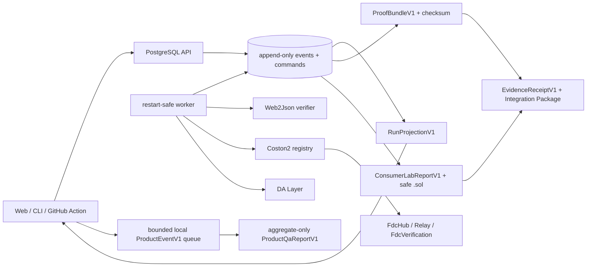

# Proofline architecture

## Назначение системы

Proofline превращает `Web2JsonManifestV1` в проверяемую цепочку evidence. Пользовательские поверхности не реализуют FDC lifecycle самостоятельно: они работают через общие contracts и persisted run API.

## Dependency direction

| Область | Ответственность | Не должна делать |
|---|---|---|
| `packages/contracts` | Versioned schemas и API types | I/O, clocks, persistence |
| `packages/domain` | State machine, journal, projection, diagnostics, replay, checksum, codegen, aggregate QA reporting | Network, PostgreSQL, process env |
| `packages/fdc-coston2` | Verifier, RPC, registry, Relay и DA ports/adapters | Владеть пользовательским flow или persistence |
| `apps/api` | Auth, idempotent HTTP commands, journal/artifact reads, PostgreSQL composition | Хранить private keys, выполнять relayer effect |
| `apps/worker` | Claim persisted commands, выполнять external effects, append outcomes, resume after restart | Принимать команды в обход API или использовать test adapters в production |
| `src`, `packages/cli`, `packages/action` | Пользовательские surfaces поверх публичных contracts | Дублировать lifecycle или обходить persisted release path |

Разрешённое направление зависимостей: contracts → domain → adapters/composition → surfaces. Pure packages не импортируют runtime composition.

## Network capability boundary

`FdcNetworkV1` — закрытый публичный словарь `coston2 | flare`, но выполнение
Web2Json определяется отдельным `NetworkCapabilityV1`. Публичный
`GET /v1/networks` возвращает канонические wallet/explorer metadata без
аутентификации и без upstream I/O: Coston2 имеет статус `enabled`, Flare —
`upstream-unsupported`.

Manifest может сохранить обе известные identity, чтобы поверхность честно
объяснила недоступность. API после project authentication и strict body
validation отклоняет Flare с `409 NETWORK_CAPABILITY_DISABLED` до
`service.createRun`. Production service повторяет guard до PostgreSQL. Поэтому
registry, verifier, source fetch, RPC, Relay и DA для Flare недостижимы.
Отдельный `Coston2Web2JsonManifestV1` дополнительно защищает `RUN_CREATED`,
proof bundle/replay, persisted reads, preflight, verifier и production
worker/live-adapter entries. Persisted run/proof/bundle/transaction schemas и
единственный production FDC adapter остаются Coston2-only. Условия будущей
активации зафиксированы в
[ADR 0023](docs/adr/0023-network-capability-boundary.md).

## Persisted run model

`run_events` — append-only источник истины. Каждое событие содержит `runId`, монотонный `sequence`, `type`, `occurredAt` и versioned payload. `RunProjectionV1` и `ProofBundleV1` выводятся из упорядоченного журнала.

`run_commands` — граница orchestration. Worker забирает команды через `FOR UPDATE SKIP LOCKED`, фиксирует attempt до external I/O и сохраняет outcome отдельной транзакцией. Наличие записанного transaction hash запрещает повторную broadcast после restart.

Основные таблицы:

- `projects`, `wallet_identities`, `wallet_challenges`, `api_tokens`,
  `share_tokens` — wallet tenancy, single-use auth evidence и capability tokens;
- `runs`, `run_events`, `run_artifacts` — состояние, preflight/consumer reports,
  bundle, receipt и generated Solidity artifacts;
- `run_commands` — restart-safe work queue;
- `relayer_transactions` — immutable broadcast/audit evidence.

## Live Coston2 lifecycle

1. API валидирует manifest, project token и idempotency key, создаёт run и preflight command.
2. Worker выполняет safe Web2Json preflight и получает verifier request/fee quote.
3. Wallet flow возвращает unsigned transaction и принимает отдельно broadcast tx hash. Relayer flow разрешается только авторизованному project token.
4. Worker получает receipt, вычисляет voting round через system contracts, ждёт Relay finalization и bounded DA proof.
5. Proof проверяется локально и через `FdcVerification.verifyWeb2Json` с `eth_call`.
6. Consumer Lab проверяет invariant evidence и генерирует safe consumer.
7. Bundle сериализуется canonical JSON, получает SHA-256 checksum и должен replay byte-identically.
8. Evidence Receipt и Integration Package связывают exact bundle, manifest,
   Consumer Lab result и safe Solidity для read-only handoff.

Все runtime-адреса FDC contracts, кроме известной точки registry, разрешаются через registry snapshot и попадают в evidence.

## Trust boundaries

### Tokens

- Project и share tokens должны иметь 256 бит энтропии.
- База хранит keyed digest, а не исходный token.
- Project token разрешает mutations и relayer requests в пределах проекта.
- Opaque share token привязан к одному run и разрешает только чтение. В Web он
  передаётся только через URL fragment, переносится в session storage и сразу
  удаляется из browser history URL.
- Wallet-auth boundary принимает только strict challenge/session requests с
  exact `PROOFLINE_WEB_ORIGIN`, 8 KiB Request limit и private response headers.
  Challenge хранится как exact server-authored EIP-4361 evidence и атомарно
  потребляется до локального EOA recovery. После durable consume API заново
  строит canonical message из configured origin и persisted address, nonce и
  timestamps; несовпадение exact UTF-8 bytes fail-closed как unavailable.
  PostgreSQL — единственный clock authority: challenge и browser token получают
  exact millisecond issue/expiry из DB, а application `Date` не определяет
  persisted auth evidence.
  Этот же exact configured origin — единственный CORS authority для `/v1/*`:
  preflight завершается до bearer/service dispatch, а actual success/error
  responses получают exact origin без wildcard и credentialed CORS.
  Успешная проверка под advisory lock
  переиспользует один wallet identity/default project и выпускает random
  12-hour browser project token; база хранит только keyed digest. Expired и
  revoked browser tokens не проходят существующий bearer path, а legacy token
  без expiry остаётся совместимым.
  Только подтверждённая browser session может читать account, выпускать и
  отзывать CLI/Action tokens или завершать саму себя. Issuance возвращает
  случайный 256-bit raw token ровно один раз, хранит только keyed digest и
  отдельное digest evidence idempotency intent; повтор никогда не возвращает
  секрет. CLI, Action и legacy credentials сохраняют обычный project API, но не
  получают account-management authority.
  Web Settings не принимает bearer как component prop: account refresh и
  issuance проходят через accepted session controller, который удерживает
  bearer закрытым. Raw issued token существует только в one-time component
  reveal до copy/explicit close и не попадает в storage, URL/history,
  analytics, logs, DOM attributes или serialized errors. Explicit embed,
  CLI/Action/legacy и share authority не открывают Settings management.

### Keys

- Browser подписывает через EIP-1193.
- CLI может локально использовать `PROOFLINE_COSTON2_PRIVATE_KEY` для wallet mode.
- Relayer key доступен только worker process.
- API и GitHub Action не получают relayer/verifier private credentials.

### Safe fetch

Preflight принимает только публичный HTTPS GET: port 443, без redirects, с проверенным и закреплённым DNS result, запретом private/link-local/metadata адресов, timeout и лимитом ответа 1 MB. Query, JQ и ABI должны быть совместимы и детерминированы по пяти samples.

### Relayer

Relayer жёстко ограничен chain ID `114`, вызовом `FdcHub.requestAttestation`, сохранённым request hash, registry fee quote, project/global caps, daily quota и balance floor. У команды один idempotency key, а effect авторизуется повторно непосредственно перед broadcast.

## Local product instrumentation

Web emits only enumerated `ProductEventV1` metadata into a bounded local queue.
`ProductQaReportV1` contains aggregate counters only: no raw events, session
identifiers, timestamps, URLs, manifests, transaction hashes or credentials.
Corrupt storage becomes `recovered`, denied storage becomes `unavailable`, and
analytics failure cannot block the main journey. There is no network transport,
third-party SDK or user analytics dashboard.

## Release architecture and current operational status

- PR contract: caller-supplied canonical replay bundle, без network и secrets.
- Merge-queue contract: один persisted Coston2 run через GitHub Action → API → PostgreSQL → worker.
- Live gate имеет один monotonic deadline 600000 ms на весь flow и не повторяет broadcast после фиксации tx hash.
- Evidence связывается с exact 40-hex commit hash и tree hash.
- [ADR 0029](docs/adr/0029-digitalocean-vds-deployment.md) выбирает один
  DigitalOcean Droplet/VDS: Docker Compose запускает Web, API, worker и
  PostgreSQL на том же VDS, а Caddy служит единственным TLS ingress и reverse
  proxy для same-origin `/api`.
- Public inbound разрешает только 80/443. SSH restricted административным
  allowlist или VPN. PostgreSQL host port 5432 не exposed; API и worker не
  получают public host ports, Docker socket никогда не монтируется в сервисы.
- Sites остаётся compatibility-only package и routing test. Он не является
  выбранным production host.

028A локально exports и verifies OCI archives. Frozen manifest раздельно хранит
`archiveSha256` архивных bytes и `imageManifestDigest` registry identity, а его
canonical checksum связывает commit/tree. После candidate freeze 028B
публикует exact frozen OCI bytes в GHCR без rebuild, проверяет remote digest
только против `imageManifestDigest` и создаёт отдельное immutable append-only
publication evidence. Оно не изменяет manifest/tree/images и является
единственным authority для verified digest pull на VDS. Production composition
должна выбирать этот immutable GHCR image digest, запускать one-shot
checksummed migration под PostgreSQL advisory lock до старта API и
worker и проверять schema version. PostgreSQL использует persistent named
volume. `/healthz` отделяет process liveness от `/readyz`, который проверяет
database/schema readiness и свежий worker heartbeat.

Rollback использует только ранее опубликованный schema-compatible verified
remote digest из immutable publication/deployment evidence, связанного с
`frozenReleaseManifestSha256`. Frozen manifest сообщает schema compatibility,
но не даёт pull authority; missing, mismatched, unpublished или unverified
evidence блокирует rollback. Database repair остаётся forward repair либо
restore в новый volume.

Recovery contract использует off-host WAL archiving и base backup для PITR в
private S3-compatible DigitalOcean Spaces. Credential-free acceptance должна
выполнять MinIO restore drill в отдельный volume. Droplet backup не является
database backup или PITR plan.

Эти release paths реализованы и герметично проверяются локально только в своей
текущей executable части. В репозитории нет `.github/workflows`, настроенного
merge queue, Docker VDS composition или production deployment. Hosting is not
yet provisioned; ADR 0029 выбирает target, но не доказывает его доступность.
Credentials выдаются только после завершения credential-free 022–029A,
единого full matrix и двух независимых PASS на одном tree hash. До этого hosted
или deployed live Coston2 PASS не заявляется.

## Product scope

В текущем executable scope: Coston2, Web2Json, public HTTPS GET, query/JQ/ABI,
canonical vulnerable/safe consumers, wallet/relayer, replay, CLI, Action и
Sites compatibility package. Flare Mainnet присутствует только как явно выключенная public capability;
production adapter и persisted Flare evidence отсутствуют.

Product instrumentation остаётся локальным: bounded privacy-safe event queue
сводится в canonical aggregate QA bytes. Raw events и identifiers не входят в
report, сетевого analytics transport нет.

Вне scope: Mainnet execution, custody пользовательских ключей, arbitrary
methods/headers/body, произвольные Solidity contracts и выполненный production
deploy. Credential-free composition входит в 027A–029A; provisioning,
promotion и canary остаются за credential gate.

## Решения

История решений и их статус находятся в [docs/adr/README.md](docs/adr/README.md). Критические runtime-инварианты закреплены в ADR 0001, 0005 и 0011–0013.
