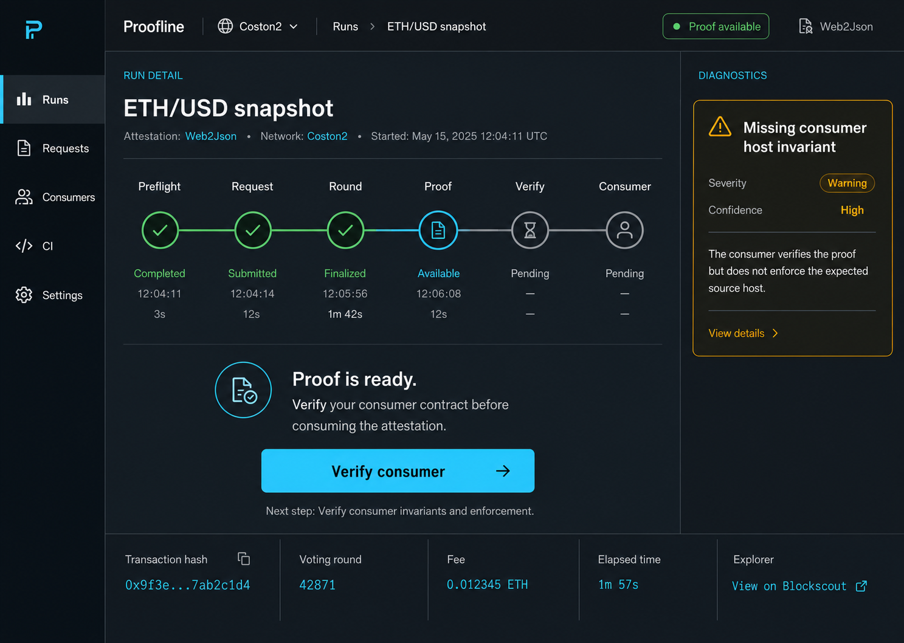
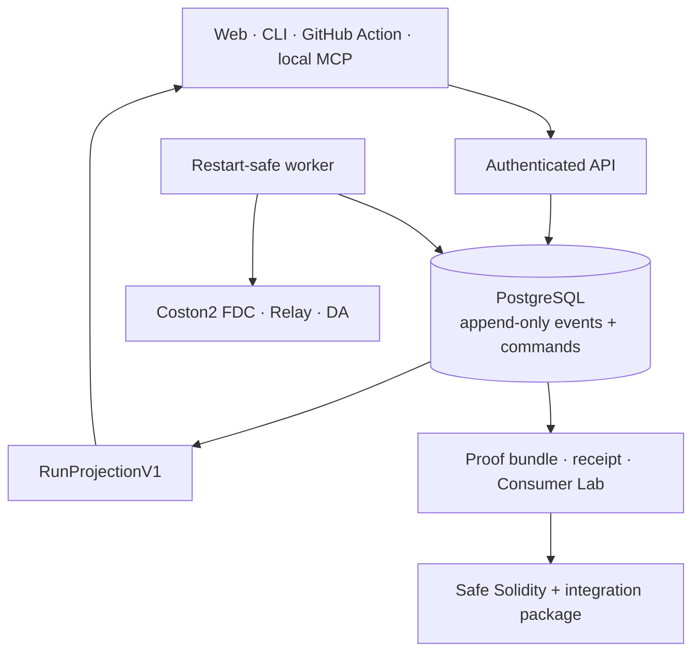

<div align="center">
  

  <h1>Orivra</h1>

  <p><strong>Verify the connection, not just the proof.</strong></p>
  <p>Evidence-backed URL trust for Flare Web2Json consumers.</p>

  <p>
    <a href="#flare-and-coston2-integration-path"></a>
    <a href="#flare-and-coston2-integration-path"></a>
    <a href="#local-ai-agent-connector"></a>
    <a href="package.json"></a>
    <a href="LICENSE"></a>
  </p>

  <p>
    <a href="https://orivra.xyz">Website</a> ·
    <a href="https://orivra.xyz/demo/canonical-url">Canonical URL attack demo</a> ·
    <a href="https://github.com/users/MarsherSusanin/projects/2">Public backlog</a> ·
    <a href="ARCHITECTURE.md">Architecture</a> ·
    <a href="CONTRIBUTING.md">Contributing</a> ·
    <a href="SECURITY.md">Security</a>
  </p>
</div>

<p align="center">
  
</p>
<p align="center"><sub>Run Cockpit: the persisted Coston2 Web2Json lifecycle from source preflight to integration package.</sub></p>

## Problem and target user

A valid FDC proof confirms a response to a request. It does **not** guarantee that
a Solidity consumer checks the intended URL before accepting that proof. A
consumer can verify authentic Web2Json evidence and still trust data from the
wrong scheme, host, path, or query.

Orivra is built for Flare developers, smart-contract teams, auditors, and agentic
development workflows that consume public Web2Json data. It turns one strict
`Web2JsonManifestV1` into:

- persisted preflight and lifecycle evidence;
- an explicit URL-invariant diagnosis for the tested consumer;
- deterministic safe Solidity that binds the expected source;
- a checksummed, replayable integration package.

The core distinction is deliberate: **proof validity and source trust are two
different facts**.

## 2–3 minute quickstart

### Try the hosted product

1. Open [orivra.xyz](https://orivra.xyz).
2. Choose the Open-Meteo Web2Json template and create a replay run. Replay mode
   exercises persisted evidence without broadcasting a blockchain transaction.
3. Follow the six-stage Run Cockpit. After proof verification, Consumer changes
   to `Ready`; select it and use `Verify consumer` to start the project-owned
   Consumer Lab operation. It is intentionally not an automatic blockchain
   effect.
4. Compare the vulnerable-consumer diagnosis with the generated safe consumer
   and export the integration package.

For a wallet-free introduction, open the
[canonical URL attack demo](https://orivra.xyz/demo/canonical-url). It shows why
a valid proof is insufficient when the consumer omits the host invariant.

The public deployment runs the Web, API, worker and PostgreSQL composition on
the selected VDS. It is a hackathon pilot, not a security audit or a guarantee
of production fitness. Deadline incident restorations may update one service
ahead of the deferred full candidate verification; the current operational
snapshot and rollback procedure live in [the runbook](docs/runbook.md).

### Run the Web locally

Requirements: Node.js `22.14.0` and npm `10.9.2`.

```bash
git clone https://github.com/MarsherSusanin/Orivra.git
cd Orivra
nvm use
npm ci
npm run dev
```

Open the Vite URL printed in the terminal. This command starts the Web client
only. API-backed runs require PostgreSQL, the API, and the worker; use the hosted
pilot for the fastest complete journey or follow [the runbook](docs/runbook.md)
for the full local composition.

## Flare and Coston2 integration path

The current live capability is Coston2, chain ID `114`. Flare mainnet is a known
network identity but remains fail-closed as `upstream-unsupported` until a
separate live capability is implemented.

```mermaid
flowchart LR
  Manifest["Web2JsonManifestV1"] --> Preflight["HTTPS source preflight"]
  Preflight --> Hub["FdcHub.requestAttestation"]
  Hub --> Relay["Relay finalization + DA proof"]
  Relay --> Verify["FdcVerification.verifyWeb2Json"]
  Verify --> Lab["Consumer Lab URL invariants"]
  Lab --> Solidity["Generated safe Solidity"]
  Solidity --> Bundle["Checksummed integration package"]
```



The worker is the only component allowed to own relayer credentials or perform
live external effects. The API never receives a user private key or a relayer
private key. Replay mode remains evidence-only.

## Architecture overview

Orivra is an npm-workspace TypeScript monorepo with pure contracts and domain
logic, explicit network adapters, persisted orchestration, and several bounded
client surfaces.



Important boundaries:

- `packages/contracts` contains versioned public schemas and no I/O.
- `packages/domain` contains deterministic state machines, canonical JSON,
  diagnostics, replay, checksums, and code generation.
- `packages/fdc-coston2` owns Coston2 adapters behind explicit ports.
- `apps/api` owns authentication, idempotent commands, and PostgreSQL
  composition.
- `apps/worker` owns restart-safe external effects and the relayer boundary.
- Web, CLI, Action, and MCP use public contracts and the persisted API path.

See [ARCHITECTURE.md](ARCHITECTURE.md) and the
[architecture decision records](docs/adr/README.md) for the detailed trust
model. The hosted pilot follows [ADR 0029](docs/adr/0029-digitalocean-vds-deployment.md):
one DigitalOcean VDS with Caddy as the only public ingress and application
services on private Compose networks.

## Local AI-agent connector

`@proofline/mcp` is a local stdio MCP server for user-controlled AI agents. It
exposes a bounded replay/evidence/Consumer Lab surface and has no wallet,
relayer, private-key, arbitrary-HTTP, or live-submission tool.

```bash
npm run build:mcp
PROOFLINE_API_URL=https://orivra.xyz/api \
PROOFLINE_PROJECT_TOKEN=project_... \
node packages/mcp/dist/index.js
```

Create a `CLI / MCP` project token in Settings. The raw token is shown once and
must be stored only in a trusted local MCP client configuration. See
[ADR 0049](docs/adr/0049-local-stdio-mcp-agent-connector.md).

## Hackathon work

This hackathon submission delivers an end-to-end Coston2 Web2Json assurance
workflow: strict manifests, persisted execution, the canonical URL-invariant
attack demonstration, Consumer Lab diagnostics, generated safe Solidity, a
Run Cockpit, replayable evidence, and local MCP access for user agents.

The submission focuses on making a subtle smart-contract trust failure visible
and reproducible. It does not claim that Orivra or generated integrations have
received a third-party security audit.

## Repository map

| Path | Purpose |
| --- | --- |
| `apps/api` | Authentication, project-scoped commands, artifacts, PostgreSQL composition |
| `apps/worker` | Restart-safe preflight, FDC lifecycle, proof and consumer effects |
| `src` / `apps/web` | React Web client and compatibility workspace |
| `packages/contracts` | Versioned schemas and public API types |
| `packages/domain` | Pure lifecycle, diagnostics, replay, checksum and codegen logic |
| `packages/fdc-coston2` | Coston2 verifier, RPC, registry, Relay and DA adapters |
| `packages/cli` | Local command-line surface |
| `packages/action` | Checked-in GitHub Action runtime artifact |
| `packages/mcp` | Local stdio MCP server for user agents |
| `contracts` | Vulnerable and safe Solidity consumer fixtures |
| `docs/adr` | Architecture and trust-boundary decisions |

All first-party npm workspaces remain `private`; this repository does not publish
npm packages as part of the hackathon submission.

## Build and testing

Install exact lockfile dependencies first:

```bash
nvm use
npm ci
```

Fast contributor gate:

```bash
npm run check:open-source
npm run typecheck
npm test
npm run build:mcp
npm run build
npm run test:sites
npm run test:action:artifact
```

The build produces the Web/Sites compatibility artifacts locally. The MCP build
produces `packages/mcp/dist/index.js`. The GitHub Action distribution is checked
in and must remain byte-synchronized with its source.

Real PostgreSQL contracts require Docker/Testcontainers and must not be counted
as passing when skipped:

```bash
PROOFLINE_TESTCONTAINERS=1 npm run test:postgres -- --maxWorkers=1
```

Additional Docker, recovery, live-Coston2, browser-accessibility, and release
gates are documented in [docs/runbook.md](docs/runbook.md). Live tests require
explicit operator-owned credentials; normal unit and replay tests do not.

`npm run test:e2e` is a hermetic Node replay test across the API and worker. It
does not replace Product Integration Verification in a real desktop/mobile
browser.

## Security

Do not put wallet keys, relayer keys, project tokens, API credentials, or `.env`
files in Git. Security issues should be reported privately as described in
[SECURITY.md](SECURITY.md). The repository includes dependency-license and
open-source-readiness checks, but their success is not a security audit.

## Contributing

Contributions are welcome. Read [CONTRIBUTING.md](CONTRIBUTING.md) before opening
a pull request. The date-free [Orivra Public Backlog](https://github.com/users/MarsherSusanin/projects/2)
contains contribution-ready product and engineering work. Changes must preserve
the persisted evidence and authorization boundaries rather than replacing them
with test-only shortcuts.

## License

Orivra first-party code is licensed under the
[Apache License 2.0](LICENSE). Solidity files that explicitly carry
`SPDX-License-Identifier: MIT` remain licensed under the MIT License in
[LICENSES/MIT.txt](LICENSES/MIT.txt). Third-party dependencies retain their own
licenses; see [THIRD_PARTY_NOTICES.md](THIRD_PARTY_NOTICES.md) and [NOTICE](NOTICE).
